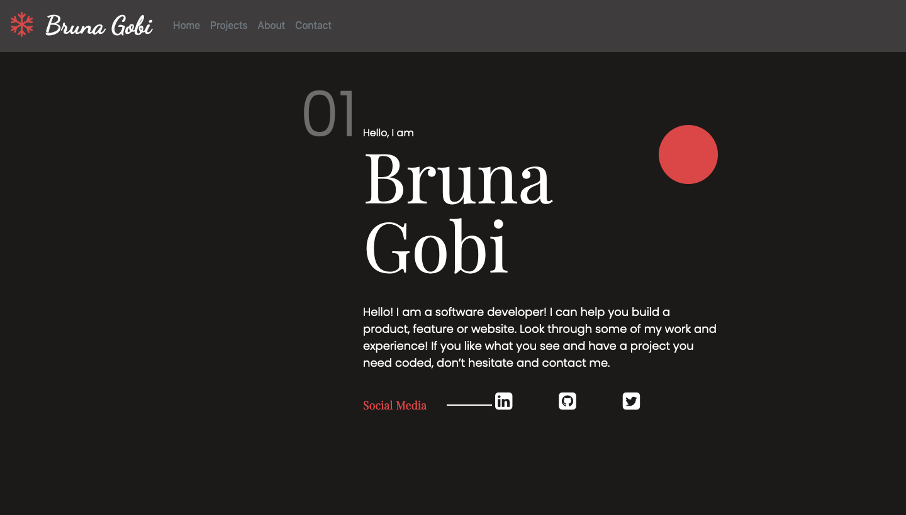
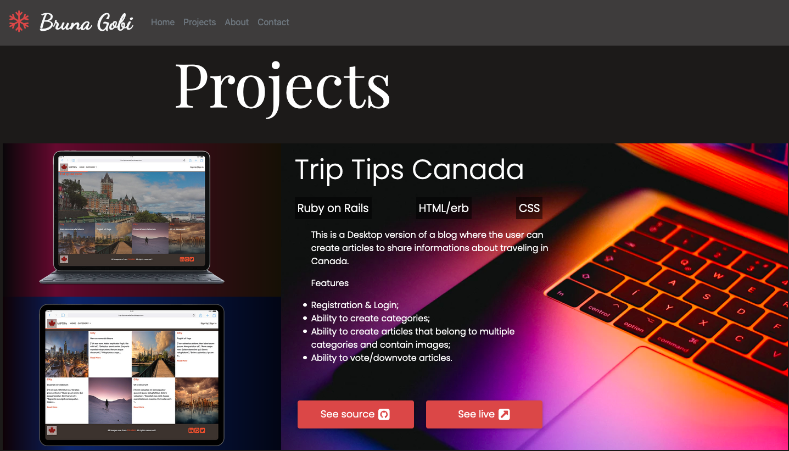
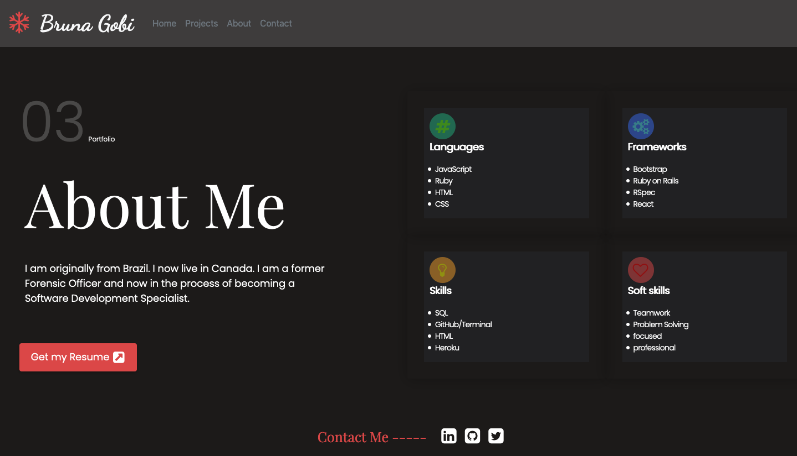

# Personal-Portfolio
My personal portfolio 

> This is my first responsive personal portfolio version, building just with HTML/CSS/BOOTSTRAP.








## Built With

- HTML
- CSS
- VSCode
- Bootstrap 4
- Stylelint

## Live Version


You can click on this [link]()


## Getting Started


### Prerequisites

- Any Brownser

To get started open the directory where you will save this repo by typing on your terminal:

```
$ cd <directory>
```

- Clone the repo typing:

```
$ git clone git@github.com:brugobi/Personal-Portfolio.git

```

### Usage

- Any Brownser

## Author

👤 **Bruna Gobi**

- Github: [@brugobi](https://github.com/brugobi)
- Twitter: [@BrunaGobi2](https://twitter.com/BrunaGobi2)
- Linkedin: [bruna-gobi](https://www.linkedin.com/in/bruna-gobi/)

## 🤝 Contributing

Contributions, issues and feature requests are welcome!

## Show your support

Give a ⭐️ if you like this project!
Feel free to check the [issues page](issues/).

## Acknowledgments

- Project requested by [Microverse Program](https://www.microverse.org/).

## 📝 License

This project is [MIT](lic.url) licensed.

